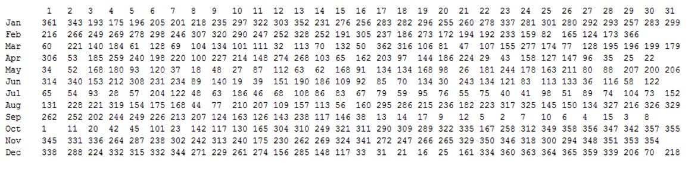

# Lab Exercise One :point_down:

The Central Statistics Office (CSO) was established in 1949 as Ireland's national statistical office and continually produce statistics on a broad range of topics. As part of their work, the CSO monitor the number of births over the course of a year (and indeed over a longer period). The organisation has ranked the popularity of each day of the year based on the average number of daily births. Number 1 rank is the most popular day of the year to be born and rank 366 is the least popular day of the year to be born.

The data they have produced is based on average data over the period 1980 – 2014

I have stored the data in a file called [“days.txt”](misc/days.txt). The content of this file is as follows:




As can be seen from the file, October 1st is the most popular/common day of the year to be born on. December 25 is the 364th most common day to be born on. Unsurprisingly, February 29th is the least common day to be born on. As the file is based on average figures, two or more days may have the same ranking.


Write a REST based Web Service where a client will pass a date of birth (the day of the year and the month will be sufficient) into the service. The web service will then parse the file and determine the popularity ranking for the date. The server will then pass this ranking back to the client where it will be displayed to the user. You have a free reign over how the service is called and what type of data it produces.  

The [following code](#file-parsing-code) will assist you in parsing the file:


How will your service handle invalid dates? For example the following are all invalid (30/02, 31/06, 0/12). The code [here](#date-validation-code)  should help you with date validation.


Develop this application firstly as a **Rest Controller** and then as a traditional **MVC style controller** (with two views, a form to gather the users input and another to display the result). 

## File Parsing Code

```java

import java.io.FileNotFoundException;
import java.io.FileReader;
import java.io.IOException;
import java.io.StreamTokenizer;

/*

Class to parse the file

Uses StreamTokenizer - StringTokenizer could also be used

*/
public class FileParser {

    //We will create a FileReader to the file and wrap it with a StreamTokenizer
    static FileReader frs = null;
    static StreamTokenizer in = null;

    //array to store each ranking wich is read from the file 366 days in a leap year,
    //no value stored in days[0] so array needs to be sized at 367
    static int[] days = new int[367];


    //store the max number of days in each month
    static int[] daysInMonths = {31, 29, 31, 30, 31, 30, 31, 31, 30, 31, 30, 31};

    //var to determine where each value which is read from the file is stored in the array
    static int day = 0;

    public static int[] fillArray() {

        readFile(); // read contents of file into array

        return days; //return array

    }//end fillArray()

    // method to read contents of file into array
    private static void readFile() {

        try {
            // Create file input and output streams
            frs = new FileReader("days.txt");

            // Create a stream tokenizer wrapping file input stream
            in = new StreamTokenizer(frs);

        } catch (FileNotFoundException ex) {
            System.out.println(ex);
        }//end catch

        try {
            //loop to read past the col headings
            for (int i = 0; i < 31; i++) {
                in.nextToken();
            }//end for

            //read the 2nd row 1st col value (i.e "Jan")
            in.nextToken();

            //while not EOF
            while (in.ttype != StreamTokenizer.TT_EOF) {

                //loop through the 12 months of the year
                for (int month = 0; month < 12; month++) {
                    //read the popularity rankings for each day in the current month
                    readDaysInMonth(month);

                    //read next token => this line will read the remainder of the row headings
                    //E.G. "Feb", "Mar"...."Dec"
                    in.nextToken();

                }//end for

            }//end while

        } catch (Exception ex) {
            System.out.println(ex);
            System.exit(0);
        }//end catch

    }//end readFile()

    //method to read the rankings for a given month
    private static void readDaysInMonth(int month) {

        for (int i = 0; i < daysInMonths[month]; i++) {
            day++; //day stores the current day of the year => 01/01 is 1, 31/12 is 366 etc
            try {
                in.nextToken(); //read the next token
            } catch (IOException ex) {
                System.out.println(ex);
            }

            int ranking = (int) in.nval; //read ranking from the stream
            days[day] = ranking; //store the ranking in the array at index day

        }//end for

    }//end readDaysInMonth()

}//end class
```

## Date Validation Code

```java
import java.text.ParseException;
import java.text.SimpleDateFormat;
import java.util.Date;
import java.util.GregorianCalendar;

class DateHelper {
//  public static void main(String[] args) {
    
//    System.out.println("Is 31/01 a valid date? " + isValidDate("31/01"));
//    System.out.println("Is 32/01 a valid date? " + isValidDate("32/01"));
//    System.out.println("Is 29/02 a valid date? " + isValidDate("29/02"));
    
//    System.out.println("\n");
    
//    System.out.println("09/02 is the "+ getSuffix(getDayOfYear("09/02")) + " day of the year");
//    System.out.println("28/06 is the "+ getSuffix(getDayOfYear("28/06")) + " day of the year");
//    System.out.println("25/12 is the "+ getSuffix(getDayOfYear("25/12")) + " day of the year");
    
    
     
 // }
    
    //this methods return value is based on a 366 day year (i.e. a leap year)
    private static int getDayOfYear(String dateString) {
        int month = 0;
        SimpleDateFormat sdf;
        Date date = null;
        try {
            month = Integer.parseInt(dateString.substring(3));

            sdf = new SimpleDateFormat("dd/MM");
            date = null;

            date = sdf.parse(dateString);
        }//end try
        catch (Exception ex) {
            System.out.println(ex);
        }//end catch
        GregorianCalendar gCal = new GregorianCalendar();
        gCal.setTime(date);

        if (month >= 3) 
            return gCal.get(GregorianCalendar.DAY_OF_YEAR) + 1;
         else 
            return gCal.get(GregorianCalendar.DAY_OF_YEAR);
    }
    
    //this method validates a date in the form dd/mm
    static boolean isValidDate(String dateToValidate) {

        dateToValidate += "/2016";
        SimpleDateFormat sdf = new SimpleDateFormat("dd/MM/yyyy");
        sdf.setLenient(false);

        try {

            //if not valid, it will throw ParseException
            sdf.parse(dateToValidate);

        } catch (ParseException e) {

            return false;
        }

        return true;

    }
    
    //returns the appropriate suffix for a number
    private static String getSuffix(int day) {
        String[] suffix = {"th", "st", "nd", "rd", "th", "th", "th", "th", "th", "th"};
        int m = day % 100;
        return String.valueOf(day) + suffix[(m > 10 && m < 20) ? 0 : (m % 10)];
    }
}

```
_to see this code running click   [here](https://replit.com/@alanryan/Assignment-Two-Helper#Main.java)_
